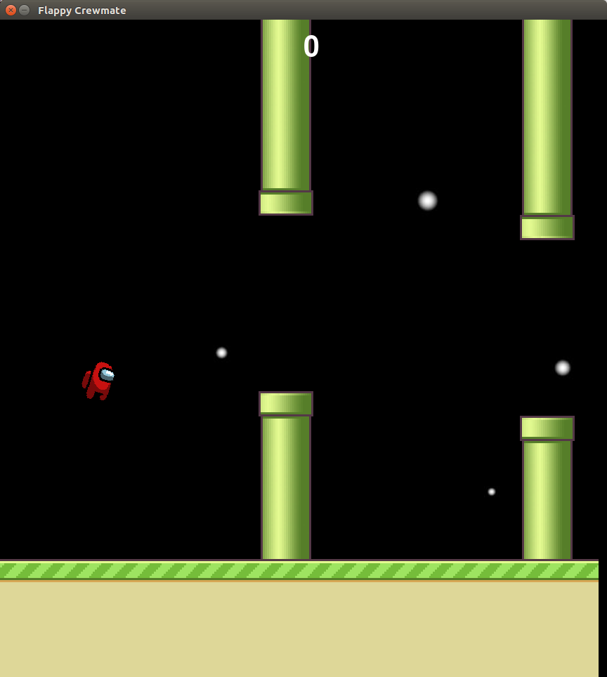
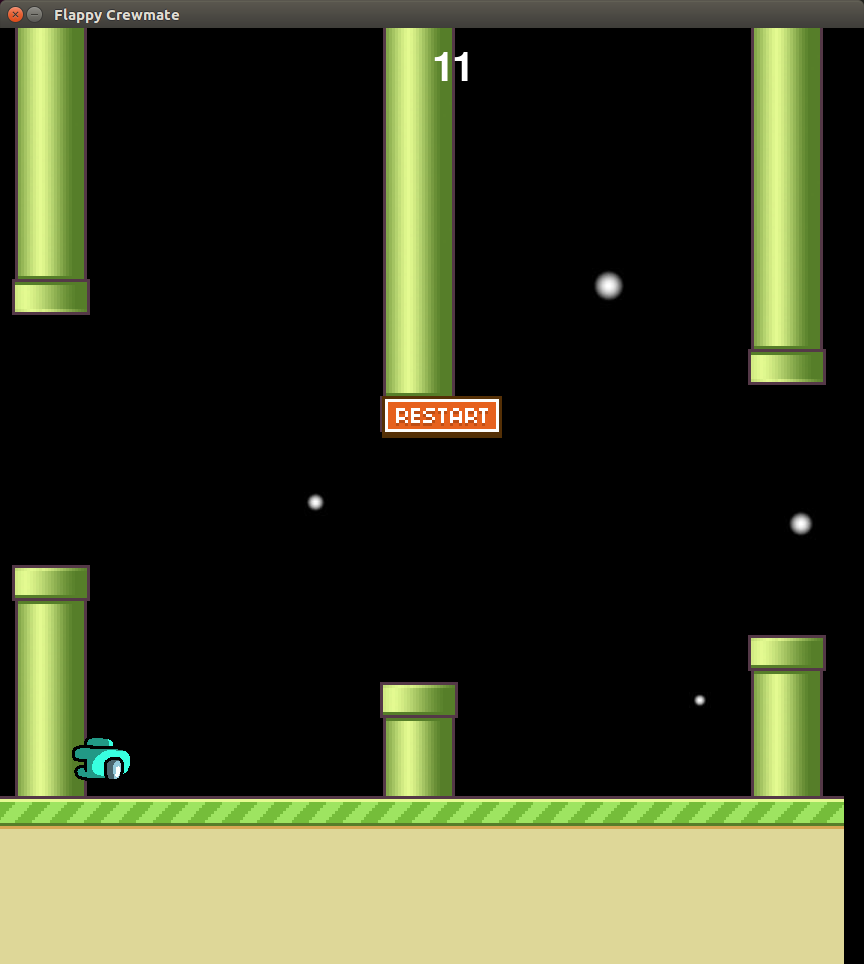

Flappy Crewmate
=======

You were an innocent crewmate unjustly ejected out of your spaceship. However, a strong solar storm blew you from the outside into the docking area of your spaceship. It is up to you to navigate through obstacles in zero gravity to get to your crew and oust the imposter. 

   &nbsp;&nbsp;&nbsp;&nbsp;&nbsp;&nbsp;     

This is a fun clone of Flappy Bird written in `pygame`. All rights to characters in Among Us and Flappy Bird belong to their respective trademark owners.

Acknowledgements
----------------

- [Flappy Bird in pygame](https://github.com/russs123/flappy_bird)
- [Sound effects source](https://www.sounds-resource.com/pc_computer/amongus/)
- [Character sprites](https://www.reddit.com/r/AmongUs/comments/iut5y2/couldnt_find_many_pngs_of_the_among_us_characters/)
